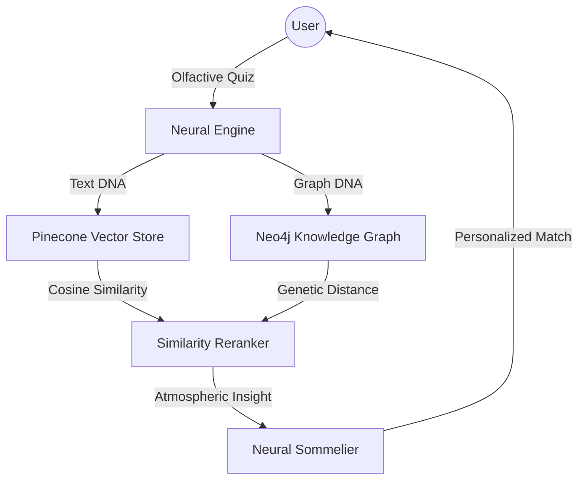

# 🌌 Scentrix — v0.01
### *The World's First Atmospheric Fragrance Discovery Engine.*

[](https://scentrix-api.up.railway.app/health)
[](https://scentrix.vercel.app)
[](https://scentrix-api.up.railway.app/redoc)

---

**Scentrix** is a digital sommelier that deconstructs the olfactive universe. By fusing **Graph Neural Networks (GraphSAGE)** with **High-Recall Dual-Vector Search**, Scentrix maps your personal scent DNA across a library of over **21,000+ fragrances**.

## 🧠 The Neural Discovery Flow

Scentrix doesn't just match keywords; it understands the molecular relationships between notes, accords, and brands.



## ✨ Core Pillars

- **Neural Sommelier (Aethera):** Generates evocative, atmospheric insights for every recommendation.
- **Adaptive Discovery:** A confidence-aware quiz that narrows down your olfactive kingdom in real-time.
- **Deep Recall:** Access to 21,500+ unique fragrances with detailed note pyramids and accord structures.
- **Privacy First:** Full GDPR compliance. Your scent DNA belongs to you—one-click data deletion and zero unconsented training.

## 🚀 Quick Start

### The Flight Proof (Local Dev)
The entire stack is containerized for deterministic scaling.

```bash
# 1. Start the Neural Stack
make up

# 2. Hydrate the Discovery Engine (21k+ Frags)
make seed

# 3. Flight Check (Backend Tests)
make test-backend
```

### Repo Map

- `frontend/` — Next.js 15 Cinematic UI (Vercel)
- `backend/` — FastAPI High-Throughput API (Railway)
- `ml/` — The Brain: GraphSAGE modeling & Scrapy pipelines
- `docs/` — Architectural blueprints and system specs

## 🛠️ Technology Stack

- **Core:** FastAPI, Next.js 15, PostgreSQL (Supabase)
- **Memory:** Neo4j Aura (Graph), Pinecone (Vector), Redis (Cache)
- **Neural:** PyTorch Geometric (GraphSAGE), Sentence-Transformers (BERT)
- **Infrastructure:** Docker, Railway, Vercel, Alembic

---

## 📅 Roadmap: v0.01 → v1.0
- [x] **v0.01:** Stable production deployment & Neural Quiz launch.
- [ ] **v0.10:** Collection Management & Community Scent-Sharing.
- [ ] **v0.20:** Real-time Olfactive Mapping (Mobile Native).

---
*Developed with obsession by the Antigravity Team.*
