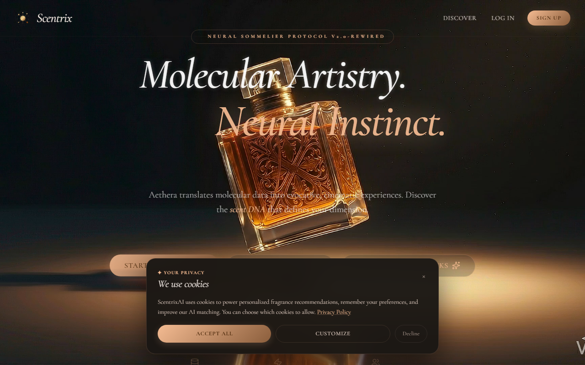
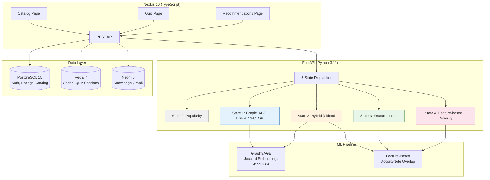
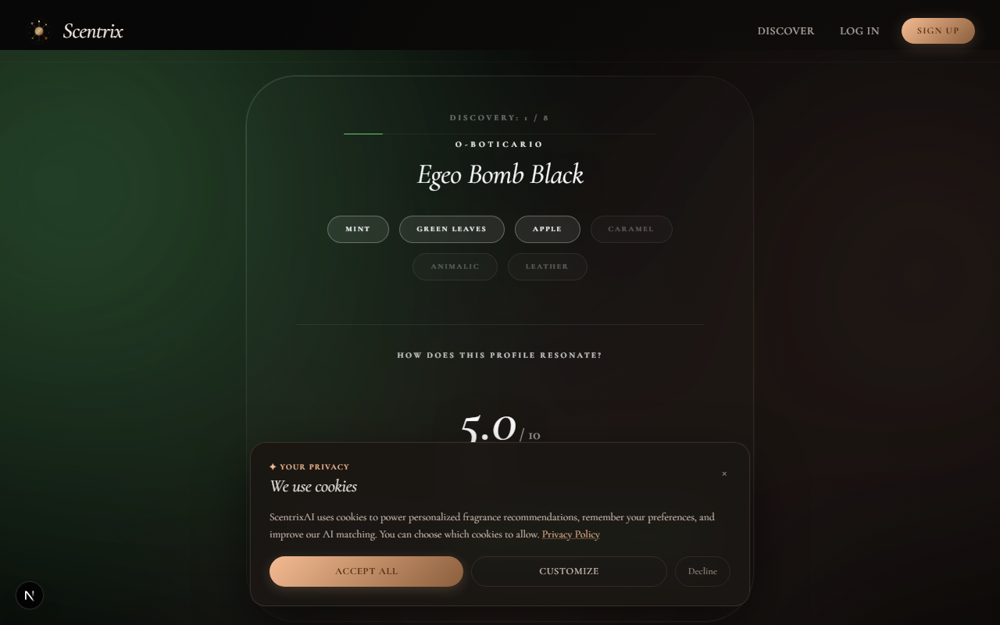
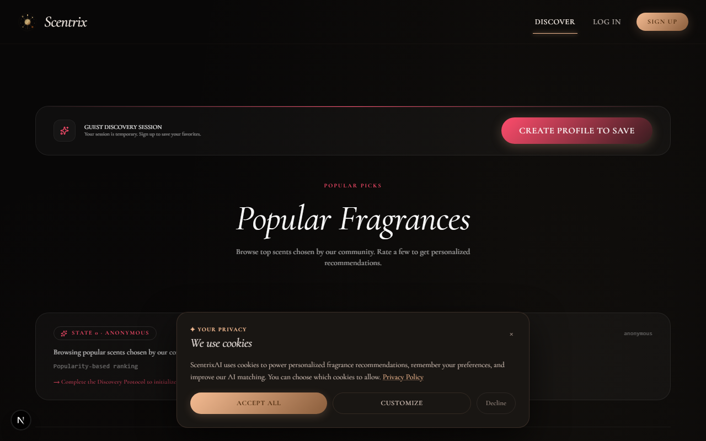

# Scentrix

Full-stack ML fragrance discovery platform with a 5-state recommendation dispatcher. End-to-end from data pipeline to deployed UI in 5 Docker containers.

[]()
[]()
[]()
[]()
[]()

**Stack:** PostgreSQL 15 | Neo4j 5 | Redis 7 | FastAPI (Python 3.11) | Next.js 16 (TypeScript) | GraphSAGE (PyTorch Geometric) | Docker Compose

<div align="center">
  
  <p><em>Fragrance catalog with search, family filters, and rating cards</em></p>
</div>

---

## Quick Start

These seven steps take you from a fresh clone to a running application with data loaded.

```bash
# 1. Clone the repository
git clone <repo-url>
cd Scentrix

# 2. Configure environment (optional — config.py ships dev defaults incl. a Fernet
#    DATA_ENCRYPTION_KEY, so a fresh clone boots without .env; deployments MUST set a
#    real key)
cp .env.example .env

# 3. Start all Docker services (Postgres, Neo4j, Redis, backend, frontend)
docker compose up -d

# 4. Run database migrations
docker compose exec backend alembic upgrade head

# 5. Seed the database with fragrances and test data
docker compose exec backend python -m scripts.seed_data

# 6. Open the application
#    → http://localhost:3000

# 7. Complete the user journey (see § below)
```

> **Tip:** After step 3, check progress with `docker compose ps` or `docker compose logs -f`. All five containers must show `healthy` before proceeding.

### Quick reference (Makefile)

```bash
make help         # Show all available make targets
make up           # docker compose up -d
make down         # docker compose down
make logs         # docker compose logs -f
make migrate      # docker compose exec backend alembic upgrade head
make seed         # docker compose exec backend python -m scripts.seed_data
make test-backend # Run backend test suite (requires running system)
```

---

## Architecture

### Architecture Overview



### 5-State Recommendation Dispatcher

| State | Label | Trigger | Strategy |
|---|---|---|---|
| 0 | Anonymous | No session | Popularity → Random fallback |
| 1 | Quiz User | Quiz completed | GraphSAGE (USER_VECTOR) → Feature-based fallback |
| 2 | Cold | 1–4 ratings | Hybrid β-blend (GraphSAGE + Feature-based) |
| 3 | Warm | 5–19 ratings | Feature-based primary |
| 4 | Mature | 20+ ratings | Feature-based + diversity injection |

Every path has a graceful fallback. The system never returns empty results. See [ARCHITECTURE.md](./docs/ARCHITECTURE.md) for full dispatch details.

### Screenshots

<div align="center">
  
  
  <p><em>Left: Adaptive quiz with 1–10 rating scale. Right: State-driven recommendations with match scores.</em></p>
</div>

### User Journey

Once the app is running at `http://localhost:3000`, follow this flow to experience the full recommendation pipeline:

#### 1. Register an account
- Open `http://localhost:3000/auth/register` (or click "Sign Up")
- Enter an email and password; you'll be logged in automatically

#### 2. Browse the fragrance catalog
- The landing page shows the fragrance catalog with search
- Click any card to see fragrance details (notes, accords, description)

#### 3. Take the preference quiz
- Navigate to `/quiz` — rate fragrances on a 1–10 scale
- The quiz adapts based on your responses
- Finalise your quiz session to submit your preferences

#### 4. View your recommendations
- Navigate to `/recommendations`
- The system moves from **State 0 (Anonymous / Popularity)** to **State 1 (Quiz User / GraphSAGE)**
- Recommendations are computed using per-item ratings weighted by GraphSAGE embeddings (USER_VECTOR path)

#### 5. Rate individual fragrances
- Click the Star icon on any fragrance card to rate (1–5 stars)
- Each rating moves you closer to the next state

#### 6. Check your profile
- Visit `/profile/history` to see your Last Quiz Summary card
- Shows total rated, average rating, top matches, and preferred notes/accords

---

## Key Engineering Achievements

- **5-state state machine dispatcher** routing by user signal maturity — anonymous users get popularity, quiz completers get GraphSAGE user vectors, frequent raters get feature-based scoring with diversity injection
- **GraphSAGE preference initialization** producing 64-dimensional embeddings from a Jaccard-similarity graph over 4,559 fragrance nodes — precomputed at build time, loaded at serving time as `.npy` files. Loading/serving the artifacts requires no PyTorch (the serving module reads NumPy arrays directly); note the backend Docker image still installs torch + torch-geometric + sentence-transformers via the `[runtime,ml]` extras (~2 GB)
- **Full-stack containerized deployment** — 5 Docker services (PostgreSQL 15, Neo4j 5, Redis 7, FastAPI, Next.js 16) orchestrated with Docker Compose
- **Observability** — Correlation ID tracing across all API endpoints, 10 structured event types, Sentry error monitoring
- **173 backend tests** (pytest; dispatcher + rating-normalization suite 105 passing) + Playwright E2E with visual regression across the complete quiz→recommendation flow
- **Load-tested at 20 concurrent users** — 1,875 requests, 1,561 successful and 314 failures (313× 429 rate-limited quiz-start responses + 1 connection error, ≈16.7%). The 429s are rate-limit responses by design; evidence in `backend/tests/load/results/load_results_stats.csv`
- **4,559 quality-filtered fragrance entries** (cleaned from 4,577 raw items by removing 18 duplicate name+brand rows), 397 brands, 72 accords

---

## Testing & Quality

```bash
# Backend tests — run on the host venv (the backend Docker image excludes dev deps,
# so pytest is not available via `docker compose exec backend pytest`)
.venv\Scripts\python.exe -m pytest backend/tests -q

# Single test file
.venv\Scripts\python.exe -m pytest backend/tests/test_phase11_quiz.py -q

# Frontend checks (from frontend/)
npm run lint                                           # ESLint
npm run format                                         # Prettier
npm run type-check                                     # TypeScript (tsc --noEmit)
npm run build                                          # Next.js production build

# E2E tests (Playwright, requires running system)
npm run test:e2e                                       # headless
npm run test:e2e:ui                                    # interactive UI mode
```

---

## ML Pipeline

The ML system evaluates GraphSAGE's ability to reconstruct a cold-start fragrance's relevant neighbours from its feature profile, without any interaction history.

**Key finding:** Evaluation showed that simple feature-based methods remained highly competitive against GraphSAGE under the final non-circular evaluation protocol.

See [docs/RESEARCH.md](./docs/RESEARCH.md) for the full research thesis, canonical results, bootstrap analysis, coldness stratification, and reproducibility commands.

---

## Project History

Started as a product-oriented perfume platform, pivoted to cold-start recommendation research, shipped as a fully containerized 5-service stack with structured logging, load testing, and a complete quiz→recommendation E2E flow.

Key milestones:
- **Architecture Freeze** (2026-05-30) — 5-state dispatch architecture locked
- **Dispatcher Activation** (2026-06-05) — State machine routing end-to-end through the UI
- **Quiz Flow Integration** (2026-06-07) — Guest persistence, state-aware UI, quiz summary
- **Observability** (2026-06-07) — Correlation ID tracing, structured logging, load testing

See [CHANGELOG.md](./docs/CHANGELOG.md) for the full change history.

---

## Research

See [docs/RESEARCH.md](./docs/RESEARCH.md) for the full research thesis, evaluation methodology, canonical results, and reproducibility commands.
